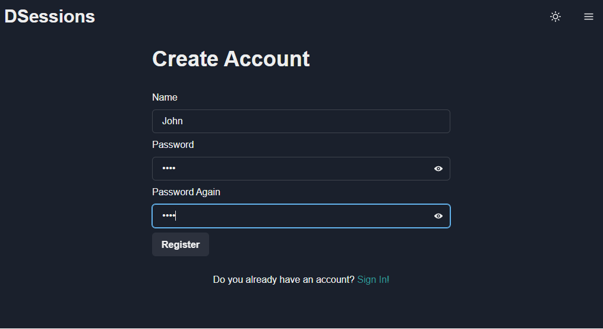
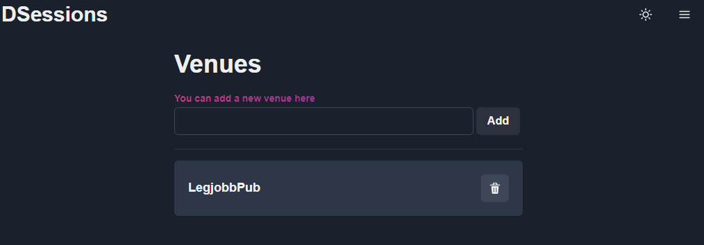
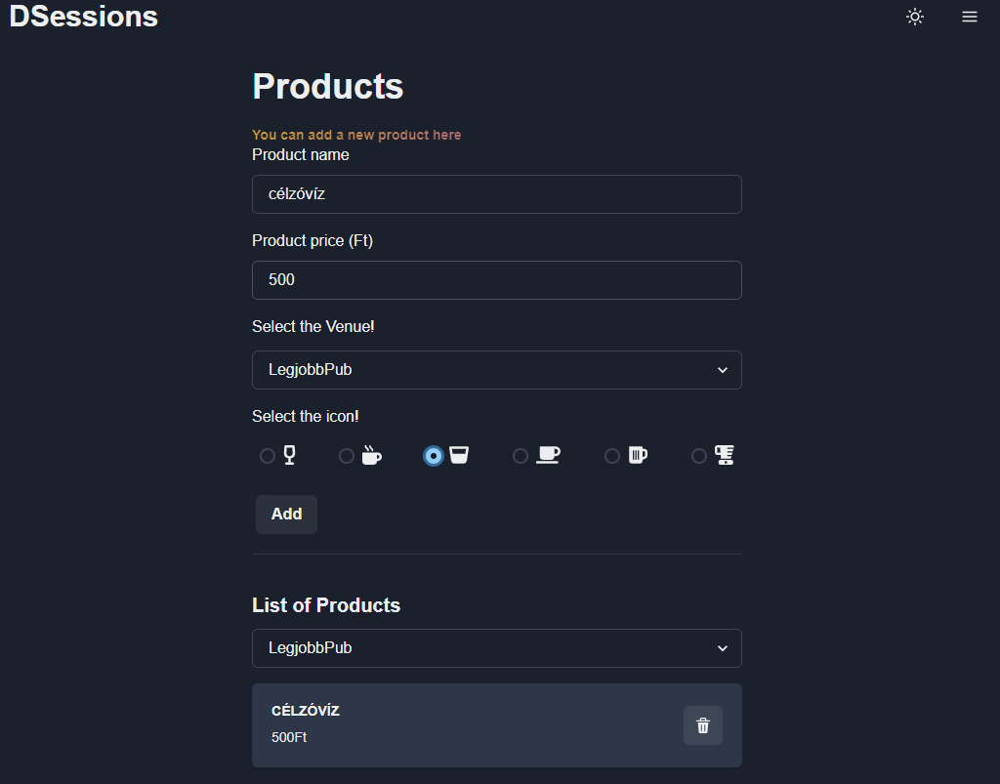
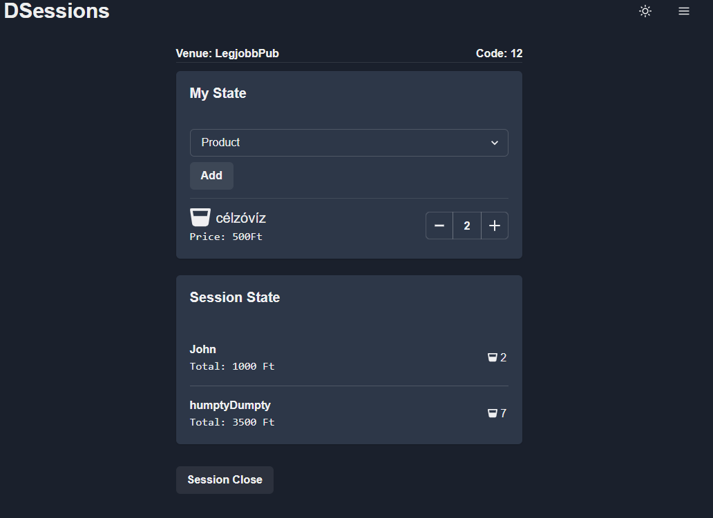
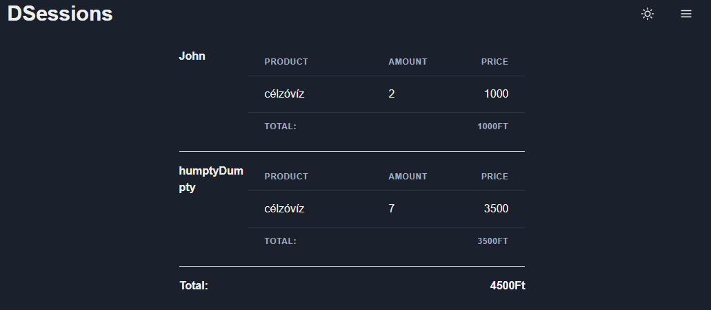

# DSessions App

A demó az adott [linken](https://dsessions.netlify.app "demo") érhető el.

Az applikáció fő funkciója, hogy valós időben megjeleníti az étel és ital fogyasztások mennyiségét és költségét a felhasználóknak és ezeket az információkat eltárolja.

A felhasználónak lehetősége van fiókot létrehozni egy felhasználónév és jelszó megadásával. Ezt a funkciót most a lehető legegyszerűbben oldottam meg, egy jwt tokent tárol el a böngészőben. 

Bejelenkezés után lehet kezelni a helyszínek és a hozzájuk rendelt termékek nyílvántartását.

Egy folyamat elindítása és lezárása is bejelntkezéshez kötött, itt a felhasználónak meg kell választani a helyszínt és be kell írni egy számot, ezután a folyamaton belül elérhetőek lesznek az adott helyszínen található termékek.
A létrehozott nyitott folyamatok a főoldalon találhatóak meg, egy felhasználónév megadása után, bárki számára elérhetőek.

Belépést követően elérhetőek a termékfogyasztás feljegyzése és termékfogyasztás mennyiségének állítása funkciók.

Az adott folyamatban jelenlévő felhasználók valós időben láthatják a termékfogyasztásokat és a termékfogyasztások mennyiségének változását és az új végösszegek kikalkulálását.

Ezt a funkciót az ASP.NET Core SignalR könyvtár segítségével oldottam meg.

A folyamat bezárását követően megjelenik egy összegzés táblázat, ahol a résztvevők fogyasztása és költségvetése látható.

(A backend jelenleg egy Azure szerveren fut egy ingyenes konfigurációval, így egy nap csak 60 percet tud üzemelni.)